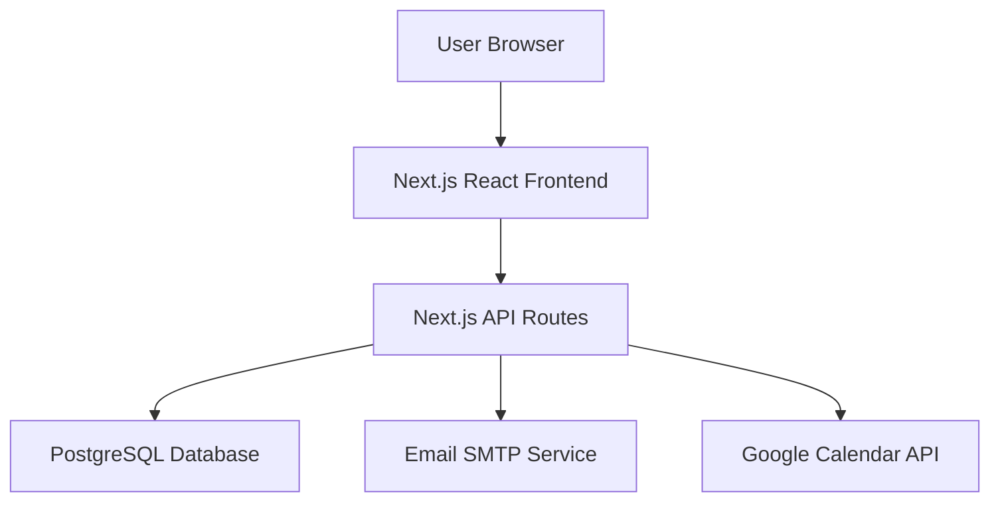
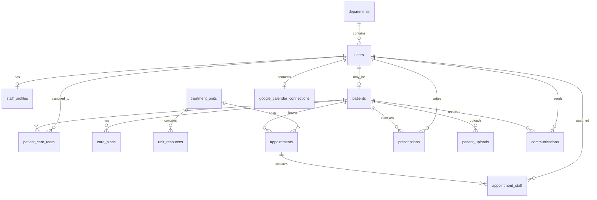
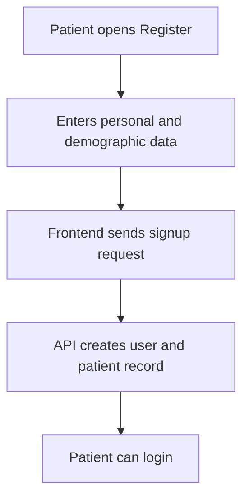
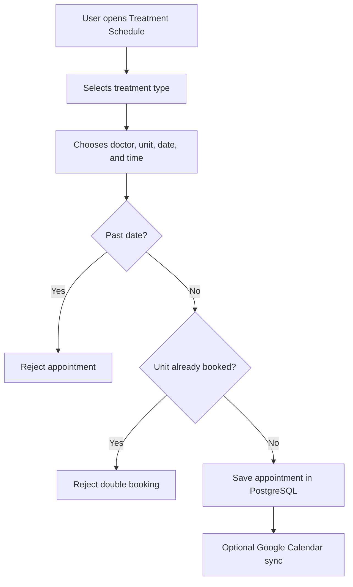
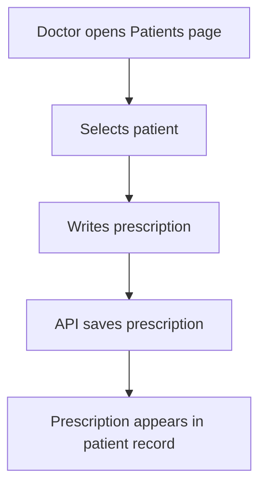
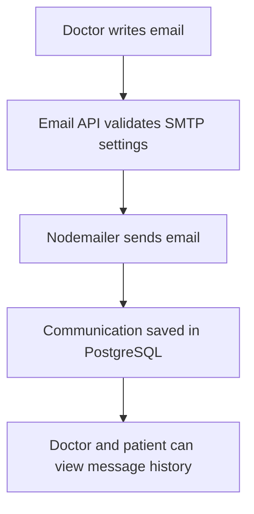
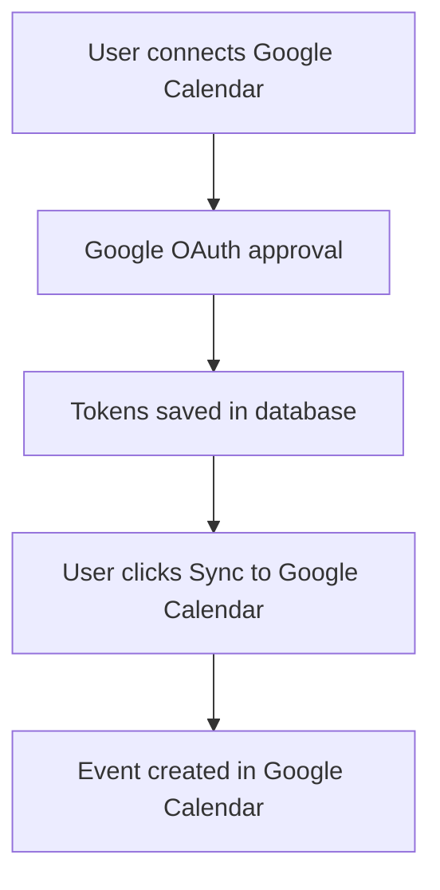
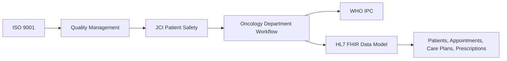

# General Oncology Department Platform Report

## 1. Project Overview

The General Oncology Department Platform is a web-based healthcare system for coordinating oncology department workflows. The project supports patient registration, patient records, treatment scheduling, treatment unit management, prescriptions, doctor-to-patient email communication, Google Calendar synchronization, analytics, and role-based access.

The selected department is the General Oncology Department. The system is designed around real oncology workflows such as chemotherapy sessions, radiotherapy sessions, follow-up visits, supportive care, care-team communication, and patient monitoring.

## 2. Project Objectives

- Build a fully functional frontend website for a hospital department.
- Use PostgreSQL as the main database.
- Provide role-based interfaces for Admin, Oncologist, Oncology Nurse, and Patient.
- Allow patients to register and request appointments.
- Allow doctors to review patients, write prescriptions, and send email messages.
- Prevent unsafe scheduling behavior such as booking in the past or double-booking the same treatment unit.
- Connect appointments to a real Google Calendar account.
- Present healthcare standards and their relationship to oncology workflow.

## 3. Website Pages

Public pages:

- Home page: introduces the oncology department platform.
- About page: explains the department purpose and services.
- Standards page: describes healthcare standards related to the system.
- Team page: shows the project team and responsibilities.
- Login page: authenticates users through the backend.
- Register page: allows public patient registration only.

Protected dashboard pages:

- Dashboard: role-based overview and guided actions.
- Patients: patient registry, patient details, prescriptions, uploads, and messages.
- Treatment Schedule: appointment creation, appointment cancellation, Google Calendar sync, and scheduling validation.
- Treatment Units: oncology unit capacity, resources, and assigned sessions.
- Analytics: live PostgreSQL statistics.
- Profile: user profile information and editing.

## 4. User Roles

Admin:

- Reviews the full department dashboard.
- Manages patient and department data.
- Views treatment units, schedules, and analytics.
- Can edit patient data.

Oncologist:

- Reviews assigned or visible patients.
- Writes prescriptions.
- Sends email messages to patients.
- Reviews appointments and treatment sessions.

Oncology Nurse:

- Reviews patients, appointments, and treatment units.
- Supports treatment coordination.

Patient:

- Registers using the public registration page.
- Views care-plan information.
- Books appointments.
- Uploads medical images or reports.
- Views saved care-team messages and prescriptions.

## 5. User Interface Design

The UI uses a clean medical design style with a restrained teal, green, white, and slate palette. The goal is to make the system professional and calm rather than overly colorful.

UI improvements include:

- Consistent navigation bar.
- Role-based dashboard cards.
- Softer shadows and borders.
- Clear action cards showing what the user should do next.
- Database error messages when backend data is unavailable.
- A page-aware Care Assistant that explains the current workflow.
- Clear success/error feedback for appointments, emails, prescriptions, and Google Calendar sync.

## 6. Software Architecture

The project uses a layered Next.js architecture:



Architecture layers:

- Presentation layer: React pages in the `app` directory.
- API layer: Next.js API routes in `app/api`.
- Data layer: PostgreSQL accessed with the `pg` package.
- Integration layer: Nodemailer SMTP and Google Calendar OAuth/API.
- Configuration layer: Railway and `.env` variables.

## 7. Database Design

The database schema is stored in `db.sql`.

Main tables:

- `departments`: hospital department records.
- `users`: login accounts for staff and patients.
- `staff_profiles`: staff specialization and license information.
- `patients`: patient demographics, diagnosis, cancer stage, and medical profile.
- `patient_care_team`: relationship between patients and clinicians.
- `care_plans`: treatment goals, protocols, sessions, and instructions.
- `treatment_units`: chemotherapy, radiotherapy, supportive care, and follow-up units.
- `unit_resources`: medical resources assigned to treatment units.
- `appointments`: scheduled oncology sessions.
- `appointment_staff`: doctors and nurses assigned to appointments.
- `prescriptions`: doctor-written prescriptions.
- `patient_uploads`: patient files, images, and reports.
- `communications`: doctor/admin email messages saved for patient records.
- `google_calendar_connections`: OAuth tokens for Google Calendar sync.



## 8. Main Workflows

Patient registration:



Appointment booking:



Doctor prescription:



Doctor email communication:



Google Calendar sync:



## 9. Healthcare Standards

The project discusses and applies several healthcare standards:

ISO 9001:2015:

- Supports process documentation, quality management, and continuous improvement.
- Reflected in clear workflows, logs, and structured care processes.

JCI Hospital Standards:

- Focus on patient safety, medication management, governance, and facility safety.
- Reflected in patient identification, treatment scheduling, prescriptions, and role-based access.

WHO Infection Prevention and Control:

- Supports safe care environments and infection risk reduction.
- Reflected in treatment-unit organization and capacity awareness.

HL7 FHIR:

- Supports healthcare interoperability and structured data exchange.
- Reflected in the way the system separates patients, appointments, care plans, and clinicians into structured resources.



## 10. Backend and Integration Features

Implemented backend features:

- PostgreSQL connection through `lib/db.js`.
- Login and patient registration.
- Role-based authorization.
- Patient create, read, update, and delete.
- Treatment unit create, read, update, and delete.
- Appointment create, read, update, and cancellation.
- Past-date validation.
- Double-booking prevention.
- Prescription creation.
- Communication history.
- Real SMTP email sending through Nodemailer.
- Google OAuth connection.
- Google Calendar event creation.
- Analytics from PostgreSQL.
- Page-aware Care Assistant.

## 11. Testing Notes

Suggested demonstration tests:

- Login as doctor/admin/patient.
- Register a new patient.
- Create an appointment.
- Try booking the same unit at the same time and show that it is rejected.
- Try choosing a date in the past and show that it is rejected.
- Write a prescription for a patient.
- Send an email to a patient and show the message history.
- Connect Google Calendar and sync an appointment.
- Open PostgreSQL/pgAdmin and show the saved tables.
- Open Analytics and show live database values.

## 12. Deployment

The project is deployed on Railway:

```text
https://6-oncology-production.up.railway.app
```

Railway is used for:

- Hosting the Next.js application.
- Hosting PostgreSQL.
- Managing environment variables.
- Deploying automatically after GitHub push.

## 13. Conclusion

The General Oncology Department Platform demonstrates a real healthcare department workflow with a working database, role-based interface, treatment scheduling, patient management, prescriptions, messaging, Google Calendar synchronization, analytics, and healthcare standards documentation. The project connects frontend design, backend APIs, database architecture, and healthcare quality principles into one complete oncology department website.
